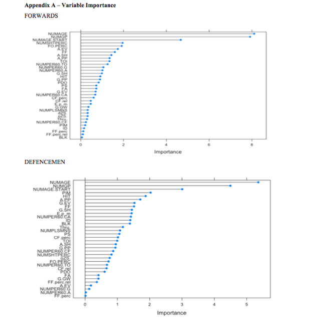
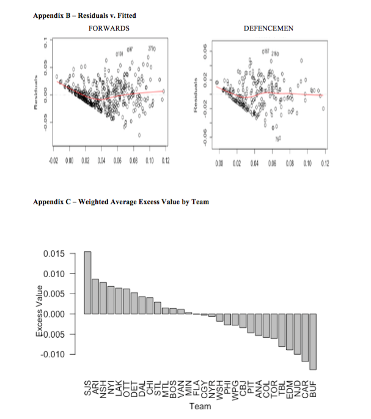
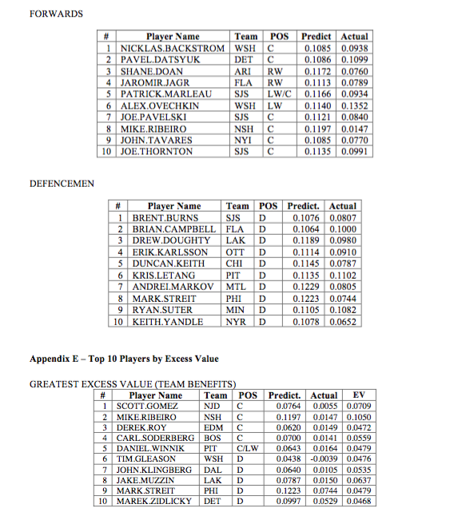
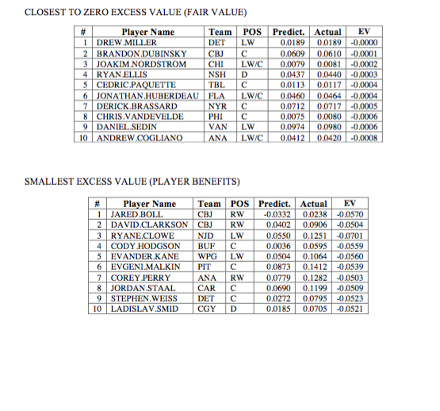

# NHL Salary Analytics

*Note: The following report was written for a final project with the target audience of a business decision maker.* 

## Introduction

**Motivation**
An NHL skater’s (i.e. not goalie) value is a sum of three main components: his on-ice
contributions, his off-ice intangibles, and his contract. Most teams use scouts and analytics of well-
defined statistics to track the players’ contributions on-ice, such as goals, assists and Corsi. Off-ice
intangibles (e.g. grit, leadership, mentorship) are difficult to quantify, subjective, and vary in importance
from team to team. NHL player salaries are well defined unlike the off-ice intangibles but there is no
defined procedure to evaluate how fair a salary is. This is made complicated by the fact that players are
paid for their future value, not just their current value. Therefore, to predict salaries, it is first important to
determine what factors result in players earning higher salaries? Second, what influences teams to
overpay certain players while ignoring players whose value exceeds their salary? Lastly, do certain teams
player evaluation techniques differ from the norm of the league?

**The Problem**
The existing process of offering contracts is flawed; teams generally identify comparable players
(by play style, tenure, and statistics) and offer contracts similar to those players. However, this creates a
circular dependency issue where the teams are relying on each other to determine the fair value of players.
Poor player evaluation techniques could carry forward through multiple players’ contracts. Using basic
and hockey advanced statistics, is it possible to generate a multi-criteria model that will allow teams to
independently predict what a player’s salary should be?

### Use Cases

#### PLAYER'S USE CASE

A player would use this model during contract negotiations. During this period, the team and the
player (and his agents) negotiate the player's salary. A player could use this model to determine his fair
value prior to entering the negotiations. Then, throughout the negotiations, the player would have a
benchmark value to compare against the teams' offer(s). A player can also use the model to know which
statistics are most related to a higher salary and focus his play on increasing those statistics.

#### TEAM'S USE CASE

The team's assistant general managers and analytic departments ("team") will be the main users of
this model. These managers will be the opposing party of the player during contract negotiations with free
agents or resigning players on the team's roster. The team's management will use the model to develop a
target salary to pay the player (e.g. 75% of the predicted salary), a "walk-away" salary (e.g. 125% of the
predicted salary) and will aim to pay the player somewhere in the range.
The model will also allow the team to identify other teams whose player evaluation techniques
differ from the norm. If a team repeatedly underpays players who are producing surplus value, then this
could indicate team has excellent player evaluation techniques and reveal clues about traits that the team
values. In contrast, if a team repeatedly overpays players who are under producing, then that team could
be a potential trade target due to their poor player evaluation techniques.
More importantly, the team could use the model to identify players whose value exceeds their
price. This will allow the team to take advantage of market inefficiencies when trading for players,
signing free agents or monitoring their own team.

## The Data Training Data

**Training Data**
The training data is from three sources: HockeyReference, Sportrac and a manually aggregated
spreadsheet of the league salary cap from 2008 to present. The HockeyReference and Sportrac data were
downloaded from their respective websites.
Hockey Reference splits the required data into two tables: Basic and Advanced. The Basic table
presents demographical information on the player (i.e. name, date of birth, age, team, position) along with
the high level statistics (e.g. goals, assists, face-offs, penalties, ice time). The Advanced table shows
advanced statistics (i.e. Corsi, Fenwick, Zone Starts) for each player.
The Sportrac data provides the player name, team and contract details: length, total dollar value,
average annual value and the years remaining. Note: the total dollar value of the contract represents the
base salary. Performance, practice and other off-ice incentives are not included in this figure.

The manually created spreadsheet of the league salary caps was compiled from various news
articles pertaining to the league updating the salary cap and recording the salary floor, mid-point and
salary cap for each year. This spreadsheet was used to calculate the player's salary's percentage of the
salary cap of the year the contract was signed.
The data covers only the 2 017 - 2018 season due to duplication concerns and the limited
historical salary information available. Firstly, including multiple years of data would result in
duplication, as a player would be included in the dataset multiple times (i.e. once per year). One solution
to this would be to amalgamate multiple years into one row. However, this introduces the problem of
assigning multiple years of statistics to one salary. Secondly, there is limited historical salary information
available. Most resources are replaced yearly to provide current salary information.

**Testing Data**
Since salary data for previous years was not readily available, a different data source was required
for the testing data set. Rob Vollman's "Super Spreadsheet" for 2014 - 2015 covers basic and advanced
statistics from a variety of websites including HockeyReference and contractual information (i.e. the
percentage of the salary cap a player's salary possesses) (Vollman, 2015).

**Data Cleansing**
Despite originating from the same source, there were data structure differences between
HockeyReference's Basic and Advanced tables. In the Basic table, a player who was changed teams mid-
season (i.e. was traded or released and signed) was presented in multiple rows for each team on which
they played on, plus a "total" row that summed the statistics across all teams. To standardize the structure,
all non-totals rows for skaters who played on multiple teams were filtered out.
In the Advanced table, there was missing data in several columns. For the columns Shooting %,
Shots Through, and Face-off % where the missing data represented "no activity", the value zero was
assigned. For example, all defencemen had no activity on face-offs. For the columns On Ice Save % and
PDO, the median value was assigned to the players missing data in these columns. Although the value of

the missing column may not be reflective of the individual’s value, this was done to minimize the impact
the missing data would have on the entire dataset.
Another discrepancy occurred between HockeyReference and Sportrac - the formatting and
abbreviation of NHL players' names varied (i.e. “Matt” vs. “Matthew”). Additionally, names with special
characters (i.e. dash, period or apostrophe) and the spelling of Russian names varied between
HockeyReference and Sportrac. To resolve this issue, all names were subjected to the same name
cleansing routine that normalized the names across the different sources. The individual cases where the
name was abbreviated were resolved by hand.
The Sportrac data was cleansed to remove the text from numeric fields (i.e. removing the text
"yr" after every contract term length) allowing the fields to be interpreted as numbers. Lastly, the Basic,
Advanced and Sportrac tables were combined into one table. A minimum requirement of 10 games played
was required to filter out players who did not have a large enough sample size.

### Data Validation

The HockeyReference data is highly reputable and trusted within the industry. Random sampling
was done by comparing the statistics of one player, every 50 rows and comparing that data to NHL.com
(i.e. 14 players in total). There were no material differences, only small differences occurred in time on
ice that were negligible. However, the Sportrac data is not as reliable, despite being the "largest online
sports team & player contract resource on the web" (Ginniti, 2007). This is an unmitigated risk due to the
fact that contract details are not always disclosed to the public. When manually cross-referencing
contracts with other sites that publish contracts, there were a number of contracts that differed. One
possible reason is some sites may calculate a player's salary as a function of which level he played in (i.e.
when playing in the AHL, the player earns the AHL salary; when playing in the NHL, the player earns the
NHL salary). Another possible reason is players in the NHL level are deducted salary for games missed
due to suspension or unsportsmanlike conduct fines accrued during games.

### Redundant Explanatory Variables

A final issue with the data was the fact that there were numerous redundant explanatory variables.
To simplify and generalize the model, it was important to first reduce the number of explanatory variables
as much as possible. Any column that could be represented by a combination of two or more columns was
eliminated. For example, the Points column was removed as it is the sum of goals and assists. Duplicates
were removed by summarizing multiple columns into one column when the detail was not required (e.g.
face-off wins and face-off losses were summarized into face-off win percentage).

## Analysis

Multiple Linear Regression (MLR) models the relationship between two or more explanatory
variables (i.e. independent variables) and a response variable (i.e. dependent variable) (Lacey, 1998). The
output of the model will be two items: the relative importance of each explanatory variable (i.e. a weight)
and a mathematical formula combining the weights and the values to predict the response variable.

### Why Multiple Linear Regression?

First, each of the explanatory variables is linearly related to the response variable (Lund Research
Ltd., 2013). Essentially, this indicates that if the explanatory and response variable were plotted on a
graph, the relationship could be connected with a straight line (i.e. no curves).
Second, MLR is only suitable when response variable (salary) is a continuous number – numbers
are not fixed at certain intervals and are neither binary (i.e. response variable is not either 0 or 1) nor
categorical (i.e. there are not a fixed number of outcomes).
Last, the simplicity of MLR was a key criterion of selecting a type of prediction. If the model is
not easily understood, management may resist adoption. Additionally, a model should be updatable when
new information is made available. A more complex model would be very difficult to update if it required
retraining whenever new data is received. However, with a MLR model, a user of the model can apply
new data to the model with a calculator or Microsoft Excel.

### The Approach

The first step after data cleansing is to identify the response variable. Simply taking the salary in
the current year is not sufficient. Suppose player A and player B signed equal dollar value contracts in
consecutive years. The percentage of the salary cap that each player's contract occupies would be
different due to increases in both the salary cap and inflation. Additionally, the salary in the current year
may be front or back-loaded resulting in an inaccurate representation of the current year's salary. To
mitigate this issue, the response variable is the annual average value of the contract (i.e. total dollar value
divided by the # of years) as a percentage of the salary cap of the year the contract was signed. For
example, Alex Ovechkin's contract was signed in 2009 for $124M over 13 years. The salary cap in 2009
was $56.7M. Thus, the model would calculate Ovechkin's salary as 17% of the salary cap (i.e. $124M
÷13yrs ÷ 56.7M _x_ 100%) (CapFriendly).
Thus, the response variable will be an estimate of average annual value for the player's services.
However, the NHL’s Collective Bargaining Agreement has many restrictions on contract length and
dollar value. These limitations are not reflected in the model, which may result in negative salaries
(violating the minimum salary clause) or areas where players salaries are much lower than predicted due
to contract maximums for younger players, yet to reach unrestricted free agency status.

EXPLANATORY VARIABLEIt is first important to consider that the priorities of forwards and defencemen differ. ThusS (^) , two
different models will be generated: one for forwards and one for defencemen.
The specific variables were selected by the t-statistic, which describes how extreme a variable is
(i.e. is the explanatory variable’s impact on the response variable due to random chance or the actual
variable) (Simon). A t-statistic further away (positive or negative) from zero is "better". The t-statistic is
advantageous because it is in the units of the response variable (Runkel, 2016). Thus, it is possible to
quantify how important a variable is to predicting salaries. Refer to Appendix A for a plot of the
importance of each variable. Similarly to the initial data cleansing, some manual tweaking was done to
streamline the model and improve the accuracy. For instance, including the age of the player when he

signed his contract and the age of the player at the present day were repetitive and the former did not
materially impact the model if the current age was already included in the model.
The models were trained with the 2017 - 2018 data resulting in the two linear equations below.

The output of these equations is the response variable --- the percentage of the salary cap that the
player is estimated to occupy. To obtain the player's estimated salary, multiply the value obtained from
the equation by the salary cap of the year to be predicted.
The weights associated with each explanatory variable are intuitive: as the player ages, generates
more powerplay assists, shots increase, the predicted salary increases, while as the hits given increases,
the salary decreases, reflecting the game today favouring speed over physicality. However, as the number
of games played increases, the predicted salary decreases. Although this may seem illogical at first, if all
other variables are held constant and the number of games played increases, then the other statistics
decrease on a per game basis making the player less valuable.
These equations will then be applied to the testing dataset from the 2015 - 2016 season. For each
player, the Excess Value is the difference between the predicted value and the actual value from the
testing dataset. This value will indicate which players are overvalued (i.e. EV < 0), which players are
undervalued (i.e. EV > 0) and which players are paid at fair value (i.e. EV = 0). Additionally, the Excess
Value can also be used to summarize a team's roster. This allows teams to be compared by the average
Excess Value of their roster.

## Results

Now that the model is defined, it is possible to determine if this model is a good predictor of a
player's salary. This will be determined by (adjusted) R^2 , which is the percentage of the salary variation
that is explained by the model, adjusted for the number of predictors in the model (four for forwards, five
for defencemen). In other words, the R^2 shows how close the actual data point is from the prediction line

(after plotting the equation on a graph). In general, the higher the R^2 , the better the data fits the model
(where the highest possible is 100%) (Frost, 2013).
In Appendix B, a plot of the predicted vs. actual salaries, it can be observed that the fit is quite
strong for both forwards and defencemen as the line stays in the middle of all data points. The forwards
model has an R^2 of 0.6029, meaning the four variables were able to explain 60.29% of the variation while
the defencemen model has an R^2 of 0.5919, meaning the five variables explain 59.19% of the variation.
In Appendix C, a plot of average excess value by teams weighted by actual salary (i.e. negative
excess value is more harmful to the team when the contract is larger), it is evident that San Jose, a Stanley
Cup finalist, has extracted significantly more excess value than any other teams. The reasons for the
discrepancy are unknown but present an excellent follow-up opportunity for the other 29 teams.
Appendix D lists the top ten forwards and defencemen by predicted salary. The results are as
expected, with the marquee players occupying both lists.
In Appendix E, the tables demonstrate which players were the most overpaid, underpaid and
fairly paid in the 2015-2016 season. Nine of the top ten overpaid players were forwards. Of the top ten
most underpaid players, eight were over the age of 30, likely due to the players taking a discount for a
greater opportunity at winning the Stanley Cup.

## Recommendation

Overall, it is recommended that every NHL and its minor league associates implement NHL
salary prediction models. Predicting salary through analytics can be combined with the traditional
comparison approach to result in the best value for the team.
While both models have room for improvement, the models are fairly accurate considering the
few number of inputs, the lack of subjective inputs (i.e. 3-stars, all-star nominations, team preferences)
and the lack of adjustments made for the league minimum or collective bargaining act provisions. If a
team were to adopt the models, they could be evolved into team specific models that value certain traits
the team emphasizes in its game style and coaching with the added benefit of more accuracy as the teams
have access to proprietary information.

## Bibliography

1. CapFriendly. (n.d.). https://www.capfriendly.com/players/alex _Alex Ovechkin_. From CapFriendly: -ovechkin
2. Frost, J. (2013, May 30). _Goodness-of-Fit?_ From The Minitab Blog: [http://blog.minitab.com/blog/adventures](http://blog.minitab.com/blog/adventures) _Regression Analysis: How Do I Interpret R-squared and Assess the_ - in-statistics-
    2/regression-analysis-how-do-i-interpret-r-squared-and-assess-the-goodness-of-fit

(^) 3. Ginniti, M. (2007). _About_. From Sportrac: [http://www.spotrac.com/about/](http://www.spotrac.com/about/)

4. Lacey, M. (1998). [http://www.stat.yale.edu/Courses/1997](http://www.stat.yale.edu/Courses/1997) _Multiple Linear Regression_ - 98/101/linmult.htm. From Yale Statistics:
5. Lund Research Ltd. (2013). Laerd _Multiple Linear Regression Analysis using SPSS Statistics_. From
    Statistics: https://statistics.laerd.com/spss-tutorials/multiple-regression-using-spss-statistics.php

(^) 6. Runkel, P. (2016, November 4). _What Are T Values and P Values in Statistics?_ From The
Minitab Blog: [http://blog.minitab.com/blog/statisticsand-p-values-in-statistics](http://blog.minitab.com/blog/statisticsand-p-values-in-statistics) - and-quality-data-analysis/what-are-t-values-

7. Simon, S. (n.d.). [http://www.pmean.com/definitions/tstat.htm](http://www.pmean.com/definitions/tstat.htm) _What is a tstatistic?_ (C. M. Hospital, Producer) From
8. Vollman, R. (2015, May 30). [http://www.hockeyabstract.com/testimonials/nhl2014](http://www.hockeyabstract.com/testimonials/nhl2014) _NHL 2014-15 Player Data_ - 15playerdata. Retrieved 2015 from HockeyAbstract:

